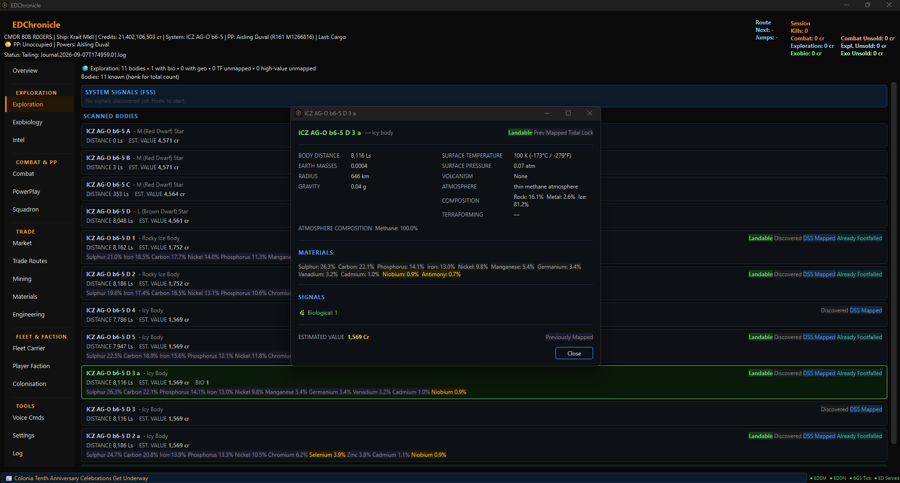
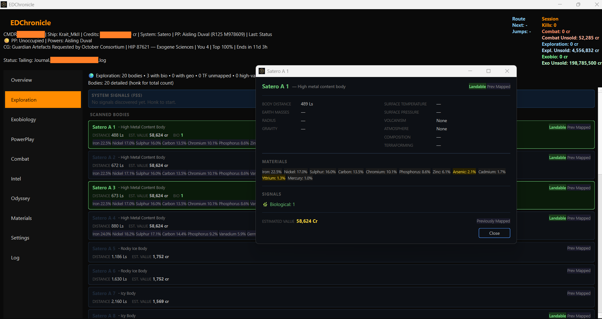
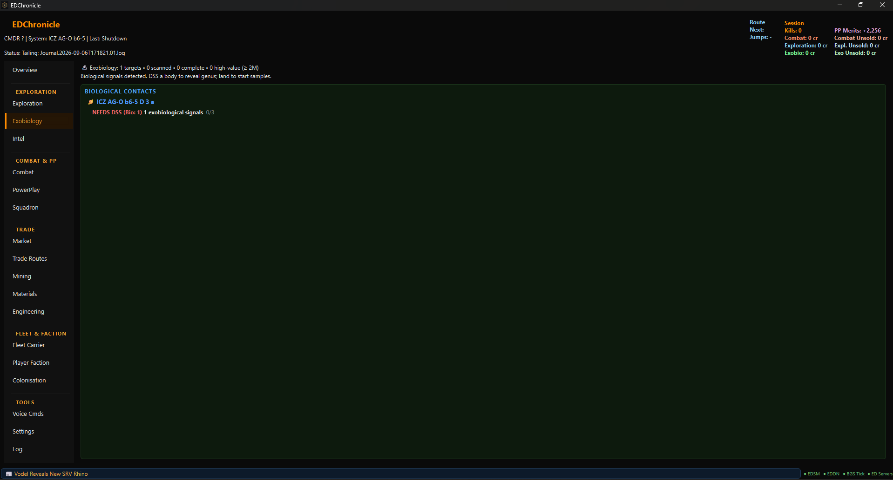
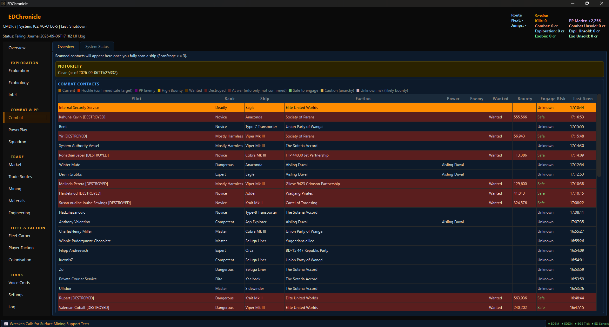
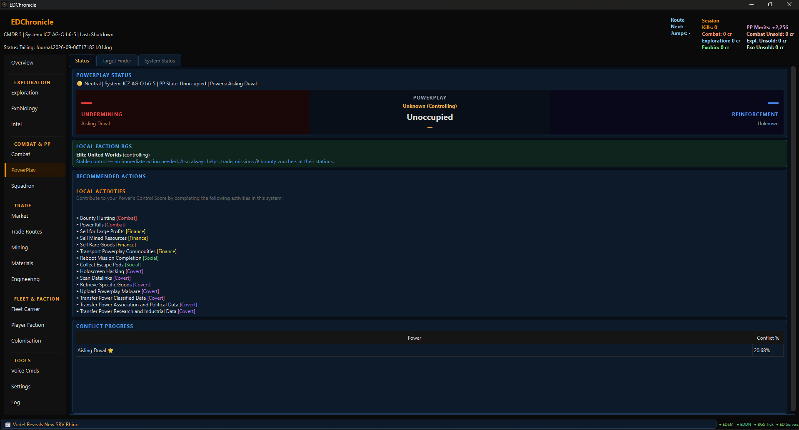
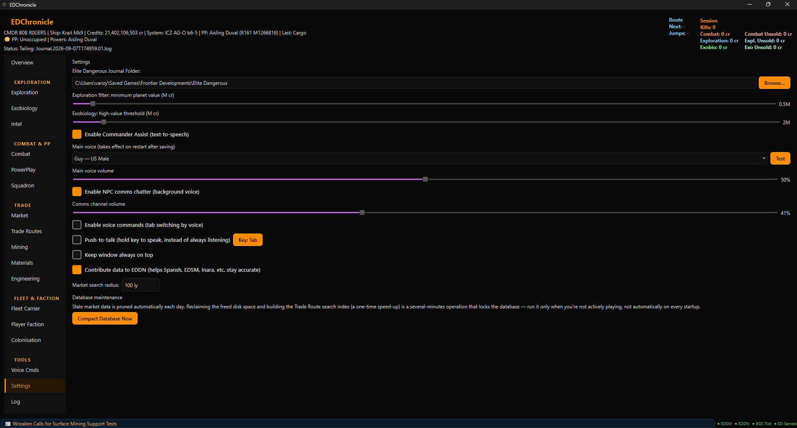

# EDChronicle

[](https://ko-fi.com/bobrogers_solo)

EDChronicle is a Python desktop companion app for Elite Dangerous built for the solo player, with a focus on Exploration, Exobiology, Combat, PowerPlay, Background Simulation (BGS)/Player Faction tracking, Market trading, Mining, Engineering, and Fleet Carriers. It monitors live journal entries and imports historical journals into a local SQLite database. Body enrichment data is optionally fetched from [Spansh](https://spansh.co.uk) when local journal data is insufficient, POI/codex intel comes from [Canonn](https://canonn.tech), and PowerPlay system control is cross-checked against [EDSM](https://www.edsm.net) and a live [EDDN](https://github.com/EDCD/EDDN) feed. EDChronicle can also optionally contribute journal data back to EDDN, the same shared network Spansh, EDSM, and Inara all draw from.

## Inspiration

Inspired by [EDCoPilot](https://www.razzafrag.com/) by CMDR RazzaFrag.

## What the app currently does

### Exploration
- Live journal monitoring and in-memory game state tracking
- Historical journal import with full backfill into local SQLite database
- Tracks all scanned bodies per system: planet class, distance, estimated value, landable status
- Detects and displays body signals: biological, geological, Guardian, Thargoid, human
- Tracks first discovery, first mapping, and first footfall status per body
- Planet detail popup with full physical stats: gravity, radius, surface temperature, pressure, atmosphere type and composition, volcanism, tidal lock, mass
- Physical stats backfilled from Spansh when original journal files are no longer on disk
- Full system scan (FSS) progress tracking
- Ring hotspot tracking: shows which bodies in the current system have rings, whether you've personally DSS'd them (with discovered materials), and flags rings with no community hotspot data anywhere (Spansh/EDDN) yet — a genuine "be first to report" gap, distinct from just not having scanned it yourself. Scan history persists across sessions and is backfilled from full journal history.
- Canonn community intel: unclaimed Codex entries known for the current system, and the nearest unclaimed Codex challenge galaxy-wide

### Exobiology
- Tracks genus, species, and variant per body
- Sample progress tracking (1 / 2 / 3 per organism)
- Estimated credit value per species with configurable high-value multiplier
- Codex entry logging and DSS genus discovery tracking

### Combat
- Combat Contacts table: every ship you've scanned this session, with rank, faction, Power, bounty, legal status, and an Engage Risk column
- Engage Risk detection based on actual Elite Dangerous Crime & Punishment rules (not guessed): `Wanted`, `Hostile`, and `Enemy` legal statuses are all flagged Safe to engage, a PowerPlay rival is flagged Safe in any system your pledged Power actively contests (controls, is contesting/undermining, or the system is Contested), Anarchy-government systems are flagged Caution, everything else defaults to Unknown rather than a false Safe
- Voice callouts are gated to genuinely actionable contacts only — `Wanted`, `Hostile`, `Enemy`, or a PowerPlay rival in a system your pledged Power actively contests — never for a ship that's your own pledged Power or your own squadron-aligned faction, and never for law enforcement/security faction ships
- BGS squadron-war context: shown as an informational note when a scanned ship's faction is at active War/Civil War with your squadron-aligned faction — not treated as a free kill, since that requires an actual Conflict Zone engagement
- Warns when your current ship (from live `Loadout` tracking) has no weapons fitted at all, regardless of the target
- Notoriety tracking with decay info, separate from active bounties
- Interstellar Factors bounty clearance: tracks outstanding `CommitCrime` bounties per issuing faction and finds the closest known station offering Interstellar Factors — galaxy-wide via EDDN `Docked` sightings, not just your own visits (excluding stations owned by the issuing faction, which can't clear it)
- Massacre mission stacking: active kill-count missions grouped by target faction and system, showing kills credited so far and stack size — one kill correctly credits every stacked mission simultaneously, matching real game behavior, and flags a mission as ready to turn in once its count is met
- Combat > System Status: War/CivilWar conflicts, multi-state factions (e.g. War+Outbreak), and RES/Low RES/High RES/Hazardous RES presence for every tracked system within a configurable radius — sourced from both the player's own journal and a live EDDN subscription, same radius-search shape as the Market tab. RES signal detection is system-level only (no ring/body granularity); status reflects the most recently confirmed sighting, not full history, and results older than 14 days are excluded from search rather than shown as possibly-stale current state.

### PowerPlay
- Live system type detection on every jump: reinforcement, undermining, or acquisition
- Displays controlling power, PP state, reinforcement score, and undermining score
- PowerPlay Target Finder tab — searches Spansh for nearby systems by mission type (reinforcement, undermining, acquisition) with distance and facility filters
- Target Finder results are cross-checked against two independent sources: a daily-refreshed EDSM PowerPlay dump and a live EDDN PowerPlay feed — agreement is confirmed, disagreement is flagged, so stale or wrong Spansh data doesn't send you to the wrong system
- Activity guide per system type driven by a local `powerplay_activities.json` config
- TTS megaship merit alert when a megaship is detected in a reinforcement or acquisition system
- Local Faction BGS card: the current system's controlling minor faction's BGS state, since Power control is ultimately backed by the local BGS

### Player Faction (BGS)
- Tracks your squadron-aligned minor faction (detected from `SquadronFaction:true` in the journal) across every system it has a presence in — not just systems you've personally visited
- Network-wide presence tracking via a live EDDN subscription, matching your squadron's faction by name across all commanders' traffic — surfaces far more systems than personal visits alone would
- Bulk import from an Inara faction-presence CSV export, resolved live via EDSM per system, with retry-on-block (EDSM sits behind Cloudflare) and skip-already-known-systems on re-import
- Manual add/remove for systems EDSM doesn't independently confirm, and stale-system reconciliation after a CSV re-import (systems no longer in the latest export are flagged for review, not silently dropped)
- Dashboard of bucket tiles (War, Election, Expansion Pending, Retreat Risk, Conflict Risk, Stale Data, No Data, No Action, etc.) — a system can land in several buckets at once (e.g. War *and* Stale Data). Clicking a tile opens a separate, movable, non-modal window listing just that bucket's systems, with search, sort, distance-from-current-system, and click-to-copy — it stays open and stays live-updated as you jump around, independent of which tab is active
- Autocomplete search across every tracked system from the main tab, independent of any bucket
- Expansion/retreat/conflict-risk forecasting from historical influence trends (`faction_snapshots`), using real Frontier BGS thresholds (expansion ≥75% influence, retreat below 2.5% with a grace window, conflict when two factions converge within a few points, both above a 7% floor) — not guessed heuristics
- Daily full EDSM refresh across every tracked system (capturing rival factions too, not just yours) — skips any system already refreshed within the last 24 hours, and the automatic (not manual) trigger stands down during Frontier's weekly server maintenance window
- Per-system recommended BGS action (e.g. "War active — combat kills help win it", "Expansion pending — keep up trade/missions/bounties") with War/Civil War/Election rows highlighted
- Active-mission tracking: which of your currently accepted missions help the squadron-aligned faction
- BGS activity attribution: bounty redemptions and trade transactions are credited to your squadron-aligned faction's running session total, but only when done at a station it actually controls — mirrors the real crediting rule, not just "anything I did nearby"
- Per-system BGS history drill-down (click a bucket dialog row's Influence cell): every faction present in that system, not just the tracked one — a forecast line per faction (expansion/retreat/conflict/active-war risk), an influence-over-time graph, and a full day-by-day table

### Squadron
- Squadron name, rank, rank history, and trophies from journal-exposed squadron events (the game does not expose a member roster, chat, or wing-mission data to third-party tools)
- Points to the Player Faction tab for the squadron's BGS data

### Market / Trading
- Manual search: best price to sell, or cheapest place to buy, a given commodity within a configurable radius — backed by a galaxy-wide EDDN commodity feed, not just your own visits
- Sortable results (price, distance, demand/stock — numeric, not alphabetical) with "Updated" shown as relative time ("3h ago") instead of a raw timestamp
- Minimum landing pad size filter (Any / Medium+ / Large only) alongside the existing range filter — stations with unconfirmed pad size are kept visible rather than hidden, since we can't rule them out
- PowerPlay and "only my squadron faction's controlled stations" filters, both applied instantly against already-fetched results
- Click a result to copy the station/system name, or pin it as your active destination — shown as a persistent banner on the Overview tab (surviving a crash/restart) until you dock there or dismiss it manually
- Automatic Trade Opportunities: cross-references your current market's buy prices against known sell prices elsewhere within range
- "In Cargo — Sell At" tracking that persists across jumps and undocking
- **Rare Goods** finder: cross-references the real list of ~140 rare goods (EDCD/FDevIDs) against their one true canonical station each, grounded by market ID rather than a plain name search — avoids the stale/duplicate listings a normal commodity search can surface for these
- **Concourse & broker service finder**: Pioneer Supplies (with Black Market confirmed too, for contraband like E-Breach), Black Market, Apex Interstellar, Frontline Solutions, Vista Genomics, Bartender, Material Trader, and Technology Broker — closest known station offering each, from a small color-coded button row, each opening its own detached window

### Trade Route Loop Planner
- Finds real A↔B↔A round trips within a configurable radius: buy commodity X cheap at Station A, sell it at Station B, buy a different commodity Y at B, sell it back at A — not a one-way flip
- Cargo capacity read live from your ship's `Loadout` event, so results are capped to what you can actually carry, further capped by each leg's own stock/demand
- Same landing pad, PowerPlay, and squadron-faction filters as Market search
- "Station A" always means whichever end of the loop is closer to you right now, so results read as "fly here first"
- Data Age column shows how old the crowdsourced price data behind each route actually is (color-coded by freshness), and fresher routes are ranked ahead of stale ones regardless of raw profit — a bigger number backed by day-old demand data isn't actually the better route

### Mining
- Live session stats: asteroids prospected, cores cracked, tons refined per material
- Ring/hotspot finder — searches Spansh for systems with rings containing a specific mineable material, sorted by distance from your current location
- "Where to sell" cross-references refined cargo against known market prices within range, sharing the Market tab's price/distance/pad-size filtering

### Materials & Engineering
- Live material inventory (Raw/Manufactured/Encoded) tracked incrementally as you collect, discard, trade, or consume materials — no need to relog for counts to update, and reconstructed at startup from full journal history (the `Materials` snapshot event only fires at login or when you open the in-game panel, so a long session can otherwise leave counts stuck at 0)
- Engineering Blueprint Wishlist tab — pick a blueprint and target grade, and EDChronicle sums material requirements across every grade from 1 up to the target using the real number of engineering rolls each grade actually takes (1/2/3/4/5 at max Engineer access, not a flat 1 roll per grade) — reaching grade 5 costs its materials ×5, not ×1
- Optional Experimental Effect per wishlist entry, filtered to what's actually valid for the selected blueprint (and, for weapons, the specific hardpoint type — Multi Cannon vs Beam Laser vs Missile Rack, etc. — rather than one generic "weapon" list), with its material cost folded into the same shortfall totals
- **Material Trader Advisor**: for each material you're short on, suggests the best real up/down-trade from a material you have plenty of, using the game's actual same-group/cross-group trade ratios
- Shows exactly which materials you're short, and how many
- Lists every known engineer who offers the selected blueprint/grade, sorted by distance from your current location, with your real unlock rank compared against what that specific grade requires
- Suits & Weapons (Odyssey) tab flags each required material as Bartender-tradeable (Chemicals/Circuits/Tech asset groups) or farm/loot only (Data and one-off Item/Consumable materials, which can't be bartered at all)
- "Sold by Carriers" search: nearby Fleet Carriers selling a needed material, closest first, with each carrier's self-reported docking access (Open/Unknown) — carriers with confirmed restricted access are filtered out entirely
- Optional voice + Overview panel alert when you're near a farming location for a material on your wishlist

### Fleet Carrier
- Tracks carrier stats, cargo, and jump status from journal events, reconstructed from full journal history at startup so state survives app restarts
- Shows your squadron's shared fleet carrier separately from your own, so it's never mistaken for your personal carrier

### Odyssey
- On-foot inventory tracking (Items, Components, Data, Consumables) from Odyssey suit/backpack events

### Intel
- External points of interest and farming location matches for the current system, cross-referenced against community data
- Nearest Farming Opportunity search: combines named farming-guide sites with live BGS-state matches across every tracked system, filterable by material, sorted by distance, click-to-copy

### Voice commands
- Say a trigger phrase to fire in-game ship actions (power distribution, cargo scoop, landing gear, etc.) via keybind dispatch — reads your actual bound keys from the game's `.binds` file
- Separate tab-navigation trigger phrase to switch tabs by voice (e.g. "hud combat", "hud market") — 14 of 18 tabs are voice-navigable
- Offline speech recognition via Vosk, with a dedicated PTT-style radio-click cue tone (not a raw beep) for trigger-heard/unrecognized feedback, at an independently configurable feedback volume

### Voice / TTS alerts
- Text-to-speech announcements via Edge TTS (Microsoft neural voices)
- Priority queue — combat alerts interrupt lower-priority exploration cues
- Per-event TTS toggle in Settings (each event type can be enabled/disabled independently)
- NPC and system text comms read aloud via a dedicated comms audio channel, automatically cut short the moment you jump out of the system (rather than continuing to play NPC chatter for a system you've already left)
- Announcement examples: FSD jump, arrival, system PP type, first discovery, first mapping, first footfall, SAA complete, FSS complete, bio/geo/Guardian/Thargoid signals, exobiology scan progress, combat under attack

### Overview panel
- Single-screen HUD showing current system, body count, PP state, active signals, unresolved bodies, and recommended actions
- Persistent banners for: active Market destination, squadron faction presence, engineering wishlist materials nearby, and Canonn Codex intel
- CMDR rank badge — Combat/Trade/Explore/CQC/Soldier/Exobiologist/Empire/Federation rank names (not raw numbers) and progress-to-next-rank, backfilled at startup from full journal history since Rank/Progress only fire once at login
- Session trade profit badge — computed from the game's own per-sale cost basis, so it nets out correctly even for cargo that was never bought (mined, looted, mission reward)
- A live Shutdown journal event (game closed) starts a delayed app auto-close with a spoken goodbye, skipped during startup catch-up and cancelled if the game restarts quickly

## Data sources & ecosystem contribution

EDChronicle draws on the same community data network the rest of the Elite Dangerous tooling ecosystem uses:

- **[Spansh](https://spansh.co.uk)** — body enrichment, PowerPlay system search, ring/hotspot mining search, ring hotspot community-data gaps
- **[EDSM](https://www.edsm.net)** — daily PowerPlay dump (independent cross-check against Spansh), and per-system faction lookups for Player Faction CSV import
- **[EDDN](https://github.com/EDCD/EDDN)** — live subscription for real-time PowerPlay cross-checking, network-wide squadron faction presence tracking, the galaxy-wide commodity price feed behind the Market tab, and station services/pad sizes crowdsourced from every commander's dockings (the same model Inara/EDSM use) — the same feed Spansh and EDSM themselves are built from
- **[Canonn](https://canonn.tech)** — community-sourced Codex/POI intel for the current system and nearest unclaimed Codex challenge
- **[Inara](https://inara.cz)** — optional bulk CSV export of a minor faction's full system presence list, for the Player Faction tab's bulk import

EDChronicle can also contribute back: "Contribute data to EDDN" in Settings (on by default, matching EDMarketConnector's own default — turn it off if you'd rather not) publishes a subset of your journal events (jumps, docking, scans, surface signal scans, carrier jumps, codex entries) to EDDN's `journal/1` schema, your own market visits (commodity buy/sell prices, stock, demand — including your own Fleet Carrier's docking access, when applicable) to EDDN's `commodity/3` schema whenever you open a station's Commodities screen, and your own Fleet Carrier's material listings to EDDN's `fcmaterials_journal/1` schema whenever you open its bartender screen — the same feeds the Market tab's search and the Engineering tab's "Sold by Carriers" search draw from. All of this benefits every tool that consumes EDDN, not just EDChronicle. No personal data beyond your commander name is included, and EDDN obfuscates that before distributing it further.

Engineering blueprint costs, Experimental Effect data, Odyssey grade/module recipes, and the Material Trader's trade ratios are static offline reference data sourced from [EDCD/coriolis-data](https://github.com/EDCD/coriolis-data), [EDCD/FDevIDs](https://github.com/EDCD/FDevIDs), [msarilar/EDEngineer](https://github.com/msarilar/EDEngineer), and [jixxed/ed-odyssey-materials-helper](https://github.com/jixxed/ed-odyssey-materials-helper) — see [THIRD_PARTY_NOTICES.md](THIRD_PARTY_NOTICES.md) for the MIT-licensed portions' full attribution.

## Screenshots









## Current architecture at a glance

The application has five main runtime paths:

### 1. Live runtime path

Handles all in-game events while playing.

Flow:

1. `edc/app.py` bootstraps the application
2. `edc/ui/main_window.py` creates the main UI
3. `MainWindow.start_auto_watch()` starts live journal and status watchers
4. `edc/core/journal_watcher.py` watches journal files and emits events
5. `edc/ui/main_window.py::_on_event(evt)` receives live events
6. `edc/core/event_engine.py::process(event)` updates in-memory state
7. `MainWindow` refreshes UI panels and routes events to TTS

### 2. Historical import path

Backfills historical journal data into local SQLite on startup.

Flow:

1. `edc/app.py` prepares an `import_runner` and passes it to `SplashScreen`
2. `SplashScreen` runs the import in a background thread, showing live progress
3. `edc/core/journal_importer.py::import_all()` processes all unprocessed journal files
4. Repository methods in `persistence/repository.py` persist systems, bodies, exobiology, signals, and ring scan history
5. Processed journal files are marked to prevent re-import on subsequent startups
6. Main window only opens after the import completes; a schema-version bump can force a one-time full re-import when new columns/tables need backfilling

### 3. Spansh enrichment path

Fetches body and ring data for the current system when local journal/community data is missing or incomplete.

Flow:

1. On `FSDJump` or `Location`, `MainWindow` triggers background workers for body enrichment, ring hotspot gap checking, and Canonn intel
2. `edc/core/spansh_client.py` queries the Spansh API for the current system's bodies and ring hotspot signals
3. Physical stats (gravity, radius, temperature, pressure, atmosphere, etc.) are saved to `spansh_bodies` for all bodies — including already-scanned ones — so they can backfill NULL fields in older records
4. `edc/ui/system_data_loader.py` merges Spansh stats into existing body recs for any fields that are still NULL after journal loading

### 4. EDDN cross-check, publish & network-wide tracking path

Cross-checks PowerPlay data, tracks squadron faction presence and galaxy-wide commodity prices, and, if enabled, contributes journal events back to the network.

Flow:

1. `edc/core/eddn_listener.py` subscribes to EDDN's live ZeroMQ relay in the background, feeding PowerPlay sightings into `edc/core/eddn_powerplay.py`, commodity/faction sightings into `edc/core/eddn_market.py`, and journal-schema messages more broadly
2. `edc/core/edsm_powerplay.py` refreshes a daily-cached EDSM PowerPlay dump on startup (a plain request with an identifying User-Agent — EDSM's Cloudflare front-end 403s the default python-requests UA, not the request itself)
3. `edc/ui/panels/powerplay_finder_panel.py` cross-checks each Spansh search result's controlling power against both sources and flags disagreement
4. `eddn_market.py` buffers commodity prices, station sightings, Fleet Carrier material listings, carrier docking access, and squadron-faction sightings in memory and flushes to SQLite periodically in a batch, rather than writing per-message
5. On every raw journal event, `MainWindow` calls `edc/core/eddn_publisher.py::observe()` to track session header fields (commander, game version, Horizons/Odyssey flags); if "Contribute data to EDDN" is enabled in Settings, `maybe_publish()` builds a schema-compliant `journal/1` message and queues it for background delivery to the EDDN gateway
6. On the `Market` event, `_load_current_market()`'s already-parsed `Market.json` dict is also handed to `maybe_publish_commodity()`, which builds a `commodity/3` message (applying EDDN's required elisions/renames, plus your own carrier's docking access when the market is confirmed your own) and queues it on the same gateway worker — same opt-in setting, no separate toggle
7. On the `FCMaterials` event, `_load_current_fcmaterials()` reads `FCMaterials.json` and hands it to `maybe_publish_fcmaterials()`, which builds an `fcmaterials_journal/1` message and queues it the same way

### 5. Player Faction (BGS) tracking path

Builds and maintains the full system-presence list for your squadron-aligned minor faction, and the bucket dashboard built on top of it.

Flow:

1. `edc/core/squadron_scanner.py` scans full journal history at startup to detect the squadron-aligned faction and any already-known presence
2. Live `Docked`/`FSDJump`/`Location` events save a faction snapshot for the current system (`faction_snapshots` table) via `MainWindow._save_faction_snapshots()`, and `MainWindow.update_reference_state()` pushes the current position to the panel on every event (cheap — just a reference update, not a rebuild) so distance calculations stay correct even without the tab open
3. The EDDN network-wide listener (path 4) supplies presence data for systems never personally visited
4. `edc/core/edsm_faction_lookup.py` + `edc/core/inara_faction_csv.py` support manual add and bulk CSV import, resolving each system live against EDSM with retry-on-block; a `_FactionRefreshWorker` re-queries every tracked system once per local calendar day (so a fresh day's first session always gets one, matching the BGS's own daily tick — not a rolling 24h window) and backfills `system_coords` via `fetch_system_coords()`
5. `edc/ui/panels/player_faction_panel.py` classifies every system into 0+ status buckets (`_compute_buckets()`, pure in-memory, no extra queries) and renders them as tiles; clicking one opens a `_FactionBucketDialog` (non-modal `QDialog`, kept alive in a dict so it survives tab switches) which re-renders live as buckets are recomputed on arrival or after a manual recheck

## Current top-level module ownership

### `edc/core`
Core runtime: state management, live watchers, journal importer, Spansh/EDSM/EDDN/Canonn clients, PowerPlay activity table, BGS/combat lookups, engineering data.

Notable files:
- `event_engine.py`
- `journal_importer.py`
- `journal_watcher.py`
- `status_watcher.py`
- `state.py`
- `spansh_client.py`
- `edsm_powerplay.py` — daily-cached EDSM PowerPlay dump cross-check
- `edsm_faction_lookup.py` — per-system faction lookup (with retry on transient failures) for Player Faction add/import
- `eddn_listener.py` / `eddn_powerplay.py` — live EDDN PowerPlay subscription
- `eddn_market.py` — buffered EDDN commodity price, station, Fleet Carrier material listing, carrier docking access, and squadron faction sighting ingestion
- `eddn_publisher.py` — opt-in `journal/1` (jumps, docking, scans...), `commodity/3` (market visits, including your own carrier's docking access), and `fcmaterials_journal/1` (your own carrier's material listings) publishing back to EDDN
- `canonn_client.py` — Canonn Codex/POI community intel
- `inara_faction_csv.py` — parses Inara's faction-presence CSV export format
- `bgs_conflicts.py` — squadron-aligned faction lookup, finds who it's at active war with in the current system, and backs BGS activity attribution (bounty/trade crediting)
- `ship_loadout.py` — classifies current ship hardpoints as armed/unarmed from `Loadout` events
- `faction_refresh_tracker.py` — persists the last full-EDSM-refresh timestamp for the Player Faction tab's 24h auto-refresh gate
- `rank_names.py` — Rank/Progress category index → real rank name tables (Elite I-V aware), verified against the community Journal Manual
- `rank_scanner.py` — full-journal-history scan for the most recent Rank/Progress values at startup (same reasoning as `notoriety_scanner.py`)
- `bounty_scanner.py` / `notoriety_scanner.py` / `squadron_scanner.py` / `carrier_scanner.py` / `mission_scanner.py` / `combat_bond_scanner.py` / `materials_scanner.py` — full-journal-history scanners that reconstruct current state at startup (bounties, notoriety, squadron, fleet carrier, active missions, unredeemed combat bonds, held materials). The five that have no periodic snapshot event to jump to (bounties, combat bonds, squadron, carrier, missions) run on a background thread (`_StartupHistoryScanWorker` in `main_window.py`) so a long journal history doesn't block the window from appearing
- `trade_routes.py` — pure A↔B↔A trade-loop-finding logic for the Trade Route Loop Planner
- `material_trading.py` — Material Trader up/down-trade suggestion logic and material grouping/grade data
- `experimental_effects.py` — Experimental Effect material costs and blueprint/weapon-type compatibility
- `odyssey_material_source.py` — Bartender-tradeable vs farm/loot-only classification for Odyssey materials
- `squadron_events.py` / `mission_events.py` — shared event-application logic used by both the live engine and the corresponding `_scanner.py`
- `market_destination.py` — persists the currently pinned Market-tab destination
- `ring_signals.py` — shared ring-name/hotspot parsing used by both the live event engine and the historical importer
- `farming_locations.py` / `external_intel.py` — community-sourced farming location and POI data for the Intel tab
- `station_pads.py` — landing pad size detection/heuristics
- `ship_command_dispatcher.py` — sends keybind-mapped input to the game window for voice ship commands
- `powerplay_activities.py`
- `item_catalog.py`
- `engineering_blueprints.py` — blueprint material costs + which engineer(s) offer each grade
- `engineering_wishlist.py` — persisted blueprint/grade build targets
- `engineer_progress_store.py` — persisted per-engineer unlock rank/status

### `edc/engine/handlers`
Feature-specific event handling logic (state mutations driven by journal events).

Notable files:
- `exploration.py`
- `exobio.py`
- `inventory.py` — includes live material inventory deltas (collect/discard/trade/craft)
- `powerplay.py`
- `mining.py`
- `fleet_carrier.py` — includes squadron-vs-personal carrier detection
- `engineers.py` — `EngineerProgress` unlock tracking
- `misc.py`

### `edc/audio`
TTS engine, audio playback, voice command recognition, and per-feature phrase banks.

Notable files:
- `tts_engine.py` — Edge TTS synthesis, priority queue, miniaudio playback, separate main/comms channels
- `_alert_edge_proc.py` — alert audio playback subprocess
- `_comms_edge_proc.py` — comms channel audio subprocess (also source of the PTT radio-click DSP used for voice-command cue tones)
- `voice_commands.py` — Vosk offline voice recognition (ship commands + tab-navigation phrases)
- `audio_devices.py` — playback/capture device resolution
- `handlers/exploration.py` — exploration TTS phrase pools
- `handlers/powerplay.py` — PowerPlay TTS phrase pools
- `handlers/combat.py` — combat TTS phrase pools
- `handlers/exobiology.py` — exobiology TTS phrase pools
- `handlers/engineering.py` — wishlist material-nearby alert phrase pool
- `handlers/status.py`

### `edc/ui`
Main window, splash screen, system data loader, formatting helpers, settings dialog, and the shared design system.

Notable files:
- `main_window.py`
- `splash_screen.py`
- `system_data_loader.py`
- `planet_detail_dialog.py`
- `settings_dialog.py`
- `formatting.py`
- `theme.py` — shared semantic color palette and type scale
- `watcher_controller.py`

### `edc/ui/panels`
Individual tab panels rendered within the main window.

Notable files:
- `overview_panel.py`
- `exploration_panel.py`
- `exobiology_panel.py`
- `combat_panel.py`
- `powerplay_panel.py`
- `powerplay_finder_panel.py`
- `mining_panel.py`
- `market_panel.py`
- `trade_route_panel.py`
- `engineering_panel.py`
- `fleet_carrier_panel.py`
- `player_faction_panel.py`
- `squadron_panel.py`
- `intel_panel.py`
- `inventory_panel.py` — `ShiplockerPanel` (Odyssey) and `MaterialsPanel`
- `voice_commands_panel.py`

### `persistence`
SQLite schema, connection layer, repository/data access layer, and schema version migrations.

Notable files:
- `database.py` — connection management, WAL mode, and `run_migrations()` for schema upgrades
- `repository.py` — all read/write operations
- `schema.py` — table definitions

## Persistence model

### Tables

| Table | Contents |
|-------|----------|
| `systems` | Visited systems: name, body count, FSS complete, first/last visit, visit count |
| `bodies` | Scanned planets: class, distance, value, signals, physical stats (gravity, radius, temp, pressure, atmosphere, composition, tidal lock, first discovered/mapped) |
| `body_signals` | Bio, geo, and human signal counts per body |
| `spansh_bodies` | Spansh-sourced body data used when journal data is missing |
| `rings` | Per-ring scan status, discovered hotspot materials, and distance — personal history, backfilled from full journal history |
| `exobiology` | Genus, species, variant, and sample count per body |
| `codex_entries` | Codex entry ID, name, and base value per organism |
| `dss_genus_discovery` | Genus discoveries recorded via DSS scan |
| `faction_snapshots` | Per-system, per-day BGS snapshot (influence, states, controlling status) for the squadron-aligned faction, from journal visits and EDDN |
| `dismissed_faction_systems` | Systems manually hidden from the Player Faction tab |
| `station_info` | Landing pad counts, station services, and (for Fleet Carriers) self-reported docking access — from `Docked` events, yours and every commander's via EDDN |
| `market_prices` | Galaxy-wide commodity prices from the EDDN commodity feed, keyed by market + commodity |
| `system_bgs_status` | Latest known War/CivilWar conflicts and multi-state factions per system, from journal visits and EDDN — one row per system, not daily history |
| `system_res_sites` | Latest known RES/Low RES/High RES/Hazardous RES tier presence per system, from journal visits and EDDN |
| `fleet_carrier_materials` | Galaxy-wide Fleet Carrier engineering material listings from EDDN, keyed by market + material |
| `system_coords` | System coordinates harvested passively from EDDN journal messages, used for Market tab distance filtering |
| `commodity_names` | Internal-name → display-name mapping, seeded from your own `Market.json` visits |
| `processed_journals` | Journal files already imported (file name + size) |
| `schema_version` | Tracks DB schema version for controlled migrations |

### Schema migrations

`database.py::run_migrations()` runs on every startup and applies any pending `ALTER TABLE`/`CREATE TABLE` statements safely (wrapped in try/except so already-existing columns/tables are silently skipped). A `schema_version` table tracks which version the DB is on. Version upgrades can trigger one-time actions such as clearing `processed_journals` to force a full journal re-import when new columns or tables need backfilling.

### Local JSON stores (outside SQLite)

Some newer features persist to plain JSON under `settings/` or `data/` rather than the SQLite database:

| File | Contents |
|------|----------|
| `settings/engineering_blueprints.json` | Blueprint material costs per grade + which engineer(s) offer each (reference data, not user-specific) |
| `settings/experimental_effects.json` | Experimental Effect material costs, blueprint-category and weapon-type compatibility (reference data, not user-specific) |
| `settings/engineer_requirements.json` | Per-engineer discover/meet/unlock/referral requirement text for the Engineers reference tab (reference data, not user-specific) |
| `settings/voice_commands.json` | Ship command bindings, tab-navigation trigger word, input/output audio device, feedback volume |
| `data/engineering_wishlist.json` | User-selected blueprint/grade build targets, each with an optional Experimental Effect and (for weapons) hardpoint type |
| `data/engineer_progress.json` | Per-engineer unlock rank/status, seeded at startup and updated on `EngineerProgress` events |
| `data/session_ledger.json` | Unsold combat/exploration/exobiology value totals for the current session |
| `data/market_destination.json` | The currently pinned Market-tab destination, if any — created on pin, deleted on arrival or manual dismiss |
| `settings/edsm_powerplay_cache.json` | Daily-refreshed EDSM PowerPlay dump cross-check cache |
| `settings/eddn_powerplay_cache.json` | Live EDDN PowerPlay sightings collected this session |

## Development tooling

| Tool | Purpose |
|------|---------|
| Visual Studio Code | Primary IDE |
| Claude Code (VS Code extension) | AI-assisted analysis, architecture discussion, and code changes |
| Python venv (Windows) | Isolated runtime environment |
| Git | Version control |
| GitHub | Remote repository and release tracking |

## Installation

Requires Python 3.10 or later — download from [python.org](https://www.python.org/downloads/).

1. Download or clone this repository
2. From the project root, run:

```
install.bat
```

This creates a Python virtual environment and installs all dependencies. It is safe to run more than once — if the virtual environment already exists it is left untouched and only new or changed dependencies are installed.

## Running the application

```
launch.bat
```

Double-click `launch.bat` from anywhere — it always resolves paths relative to the project folder. If the virtual environment is not found it will tell you to run `install.bat` first.

> **First launch note:** On first run, EDChronicle will import all your existing journal files into its local database. This can take a minute or two depending on how many journals you have. Progress is shown on the startup screen. Subsequent launches are fast — only new journals are processed.

> **Fresh database note:** Journal import only rebuilds what's in *your* journal files (visited systems, missions, bounties, etc). Galaxy-wide data — Market tab commodity prices, station services/pad sizes, and network-wide squadron faction presence — comes from the live EDDN feed (see [EDDN cross-check, publish & network-wide tracking path](#4-eddn-cross-check-publish--network-wide-tracking-path)) and only accumulates while the app is running and connected. A new database (fresh install, moved to a new PC without carrying over the old database file) starts empty on that data and rebuilds gradually — leave the app running to let it collect EDDN traffic, or dock at stations in person to log their markets directly.

## Updating

```
git pull
install.bat
```

`install.bat` is safe to re-run after an update — it will not recreate the virtual environment, only install any newly added dependencies.

## Feedback, suggestions and issues

Have a feature request, found a bug, or want to suggest an improvement?

Open an issue on GitHub: [github.com/evanvz/EDChronicle/issues](https://github.com/evanvz/EDChronicle/issues)

All feedback is welcome — whether it's a crash report, a missing feature, or an idea to make the app better for solo commanders.

## Support the project

EDChronicle is free and open-source. If it adds value to your gameplay, a coffee is always appreciated.

[](https://ko-fi.com/bobrogers_solo)

## A note on indie development

This project is built and maintained by a solo developer in personal time. If you use, share, or build on EDChronicle, please respect the work that went into it:

- Credit the original project and author in any derivative work
- Do not redistribute modified versions without clearly noting the changes made
- A link back to this repository is always appreciated

## License

[PolyForm Noncommercial License 1.0.0](https://polyformproject.org/licenses/noncommercial/1.0.0) — free to use, study, modify, and share for any noncommercial purpose (personal use, hobby projects, research, education, and similar). Commercial use — selling it, selling derivatives, or using it in a paid product or service — is not permitted without the copyright holder's permission.

Copyright © 2026 CMDR B0B R0GERS

See [LICENSE](LICENSE) for the full license text.
