# EDChronicle

[](https://ko-fi.com/bobrogers_solo)

EDChronicle is a Python desktop companion app for Elite Dangerous, built for the solo player. It watches your live journal, imports your journal history into a local database, and pulls in community data (Spansh, EDSM, Canonn, EDDN) to fill in the gaps — covering Exploration, Exobiology, Combat, PowerPlay, BGS/Player Faction tracking, Trading, Mining, Engineering, and Fleet Carriers.

Inspired by [EDCoPilot](https://www.razzafrag.com/) by CMDR RazzaFrag.

## Features

- **Exploration** — live body/signal tracking, first-discovery/mapping/footfall status, ring hotspot tracking, Spansh backfill for missing physical stats, Canonn Codex intel, nearest notable Point of Interest (EDAstro)
- **Exobiology** — genus/species/sample tracking, estimated credit values, Codex logging
- **Combat** — combat contacts table with real Crime & Punishment engage-risk detection, gated voice callouts (never your own faction/power), notoriety and bounty tracking, massacre-mission stacking, System Status (wars, RES sites) for nearby systems
- **PowerPlay** — live system-type detection, PowerPlay Target Finder cross-checked against two independent data sources, megaship alerts, and a PowerPlay allies setting (the ZYADA coalition by default when you're pledged to one of its powers) so allied systems are never shown as undermining targets and allied ships are never called out. A **Watch List** tab shows reinforcement vs undermining this cycle for your PowerPlay task systems, the supporting systems of Acquisition targets, and squad systems your power holds (from your journal and live EDDN), with systems under attack first and a one-click "Add as BGS task"
- **Player Faction (BGS)** — tracks your squadron-aligned faction galaxy-wide (not just where you've been), risk-bucket dashboard (War/Expansion/Retreat/Conflict), Inara CSV import, per-system BGS history and forecasting, a Faction Expansion Tracker for pushing one target system toward the 75% expansion threshold (influence trend, live PowerPlay standing, mission tally) — with a Forecast tab showing which of your faction's systems is next to expand, a ranked shortlist of likely target systems (looked up on EDSM, using the community-researched expansion rules), and where the last expansion landed; a new-system alert on the Overview (refreshed at most every 10 minutes) and in the Session report flags the faction appearing somewhere new, a Session BGS Activity Report covering every faction's mission/combat/CZ/trade activity for the whole session, grouped by day, and a BGS Tasks tracker for your squadron's objectives (Boost/Hinder/Vote/Fight/PowerPlay) with live per-task progress, what-to-do guidance and an Overview HUD hint. PowerPlay tasks take the Reinforcement/Acquisition/Undermining job from your squadron's objective or detect it (your journal, else EDSM), and list BGS-safe actions first. PowerPlay cards name the commodity for the job, check it was collected in a supporting system (Fortified within 20 ly / Stronghold within 30 ly of an Acquisition target), show when your next load is due (one shared allocation for all stations and commodities, about 30 minutes after your last collection; a rank-up gives a bonus load), track acquisition progress over time, and show merits per BGS tick and per PowerPlay week with an estimated control-point figure (merits ÷ 4, the journal records merits only). Mission influence is shown as INF, the usual Elite term
- **Market & Trading** — galaxy-wide best price search, Trade Opportunities, Trade Route Loop Planner, Point-to-Point Trade Finder, a BGS Supply Run finder (pick a station your squadron faction controls in your power's systems; it finds what that station buys at a profit and the best nearby place to buy it), rare goods finder, broker/service finder (Black Market, Interstellar Factors, Material Trader, etc.)
- **Mining** — session stats, ring/hotspot finder, sell-price lookup for refined cargo
- **Engineering** — live material inventory, blueprint wishlist with real per-grade roll costs, Material Trader advisor, engineer distance/rank lookup
- **Fleet Carrier** — cargo/jump status tracking, squadron vs. personal carrier separation
- **Voice** — trigger-phrase ship commands and tab navigation (offline recognition), TTS announcements for key events
- **Overview HUD** — single-screen summary of current system, active signals, and recommended actions

Full feature list, architecture, and database schema: see [ARCHITECTURE.md](ARCHITECTURE.md).

## Screenshots


**Exploration**

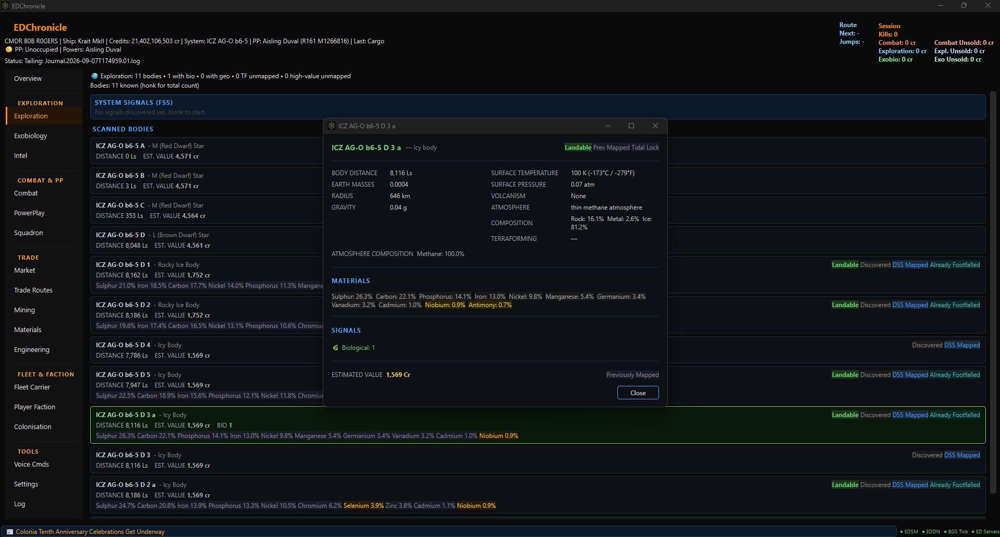
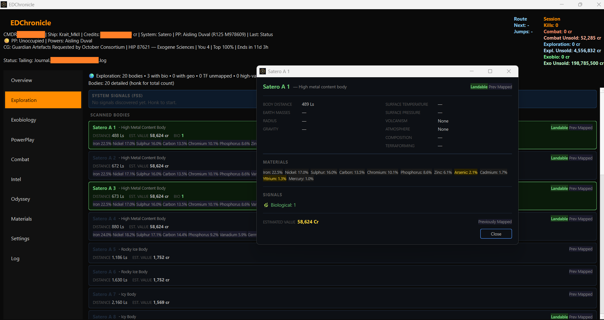
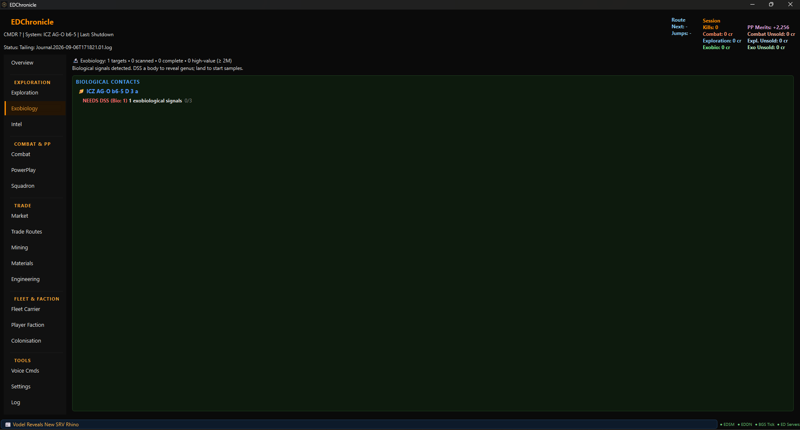
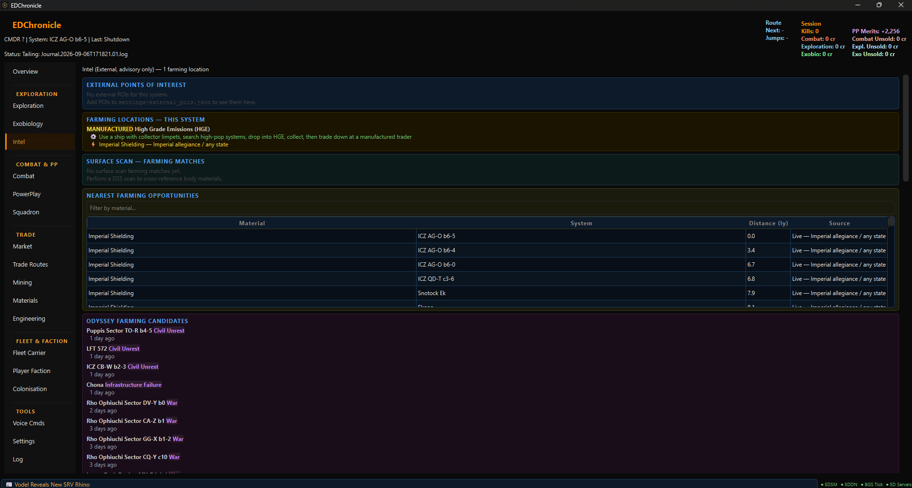

**Combat & PowerPlay**

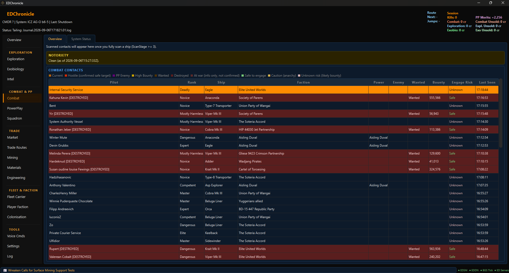

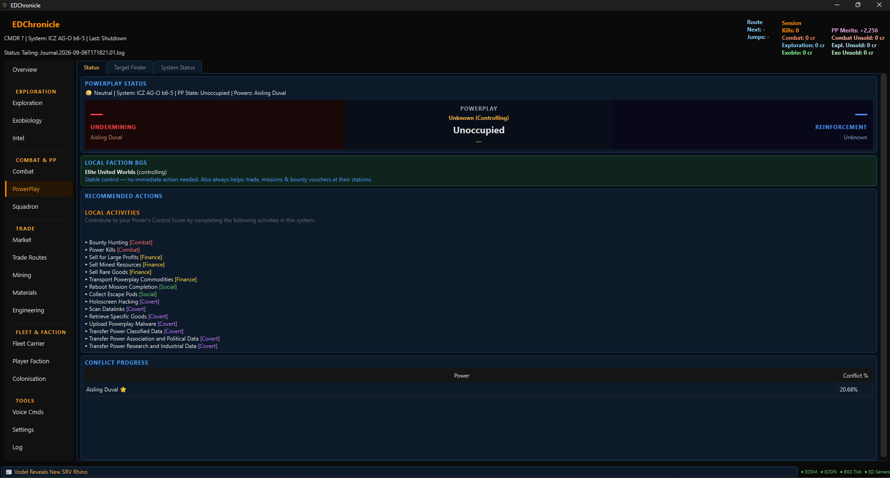


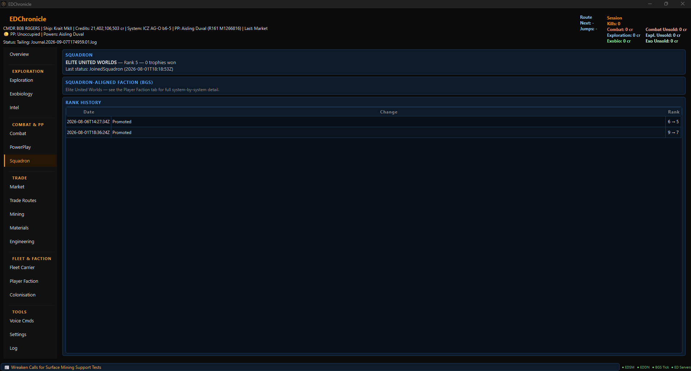

**Trade**

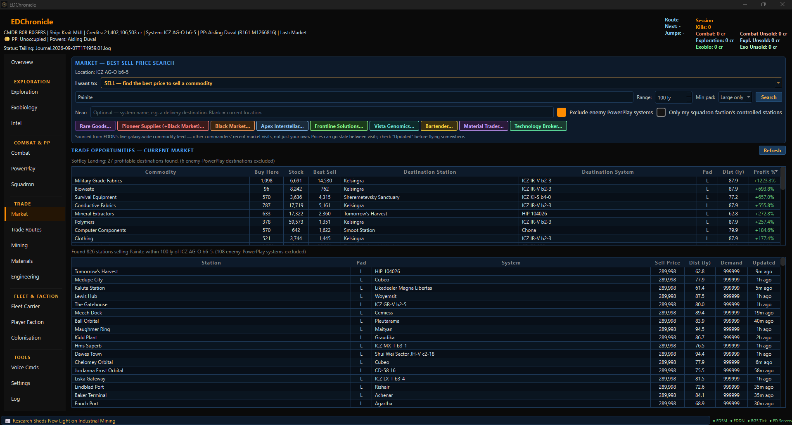

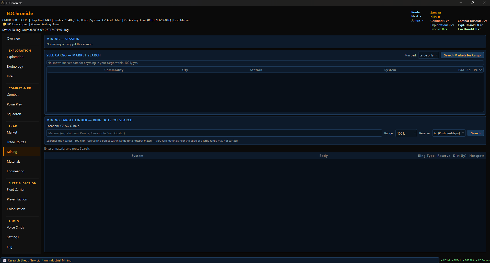
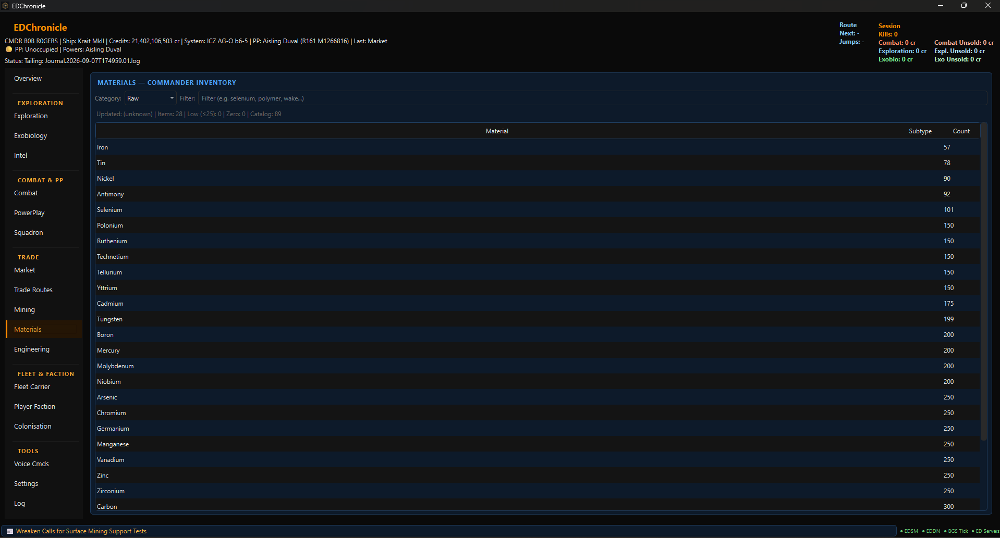
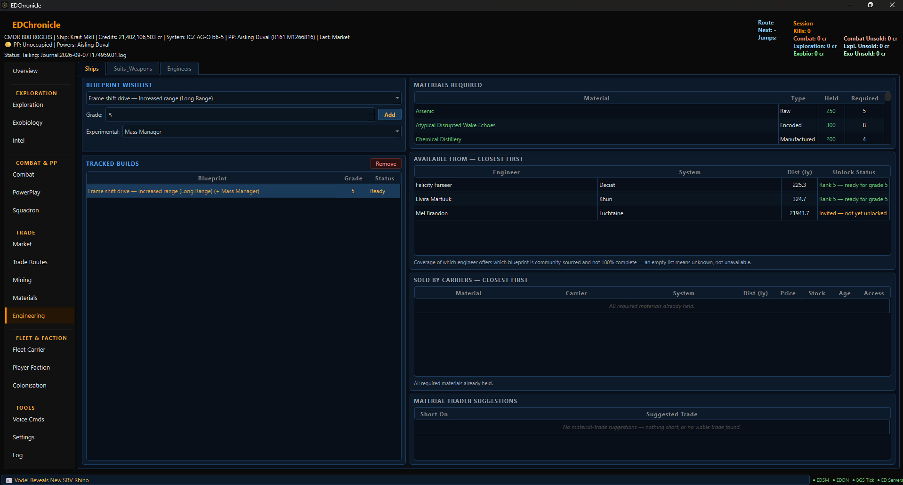
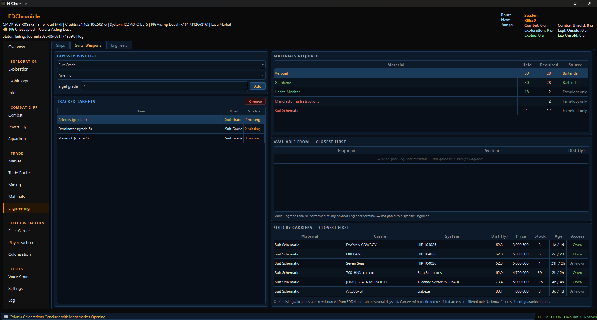
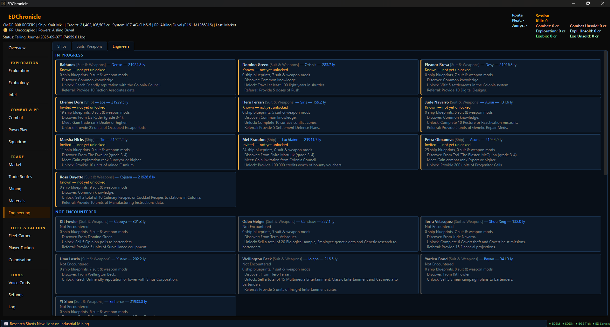

**Fleet & Faction**


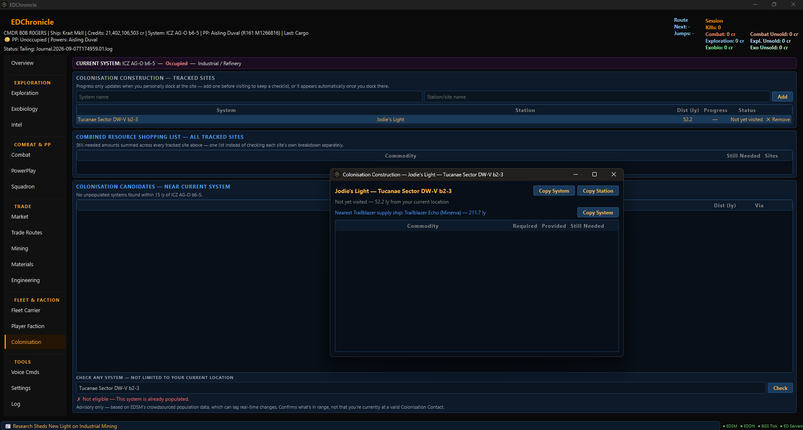

**Tools**


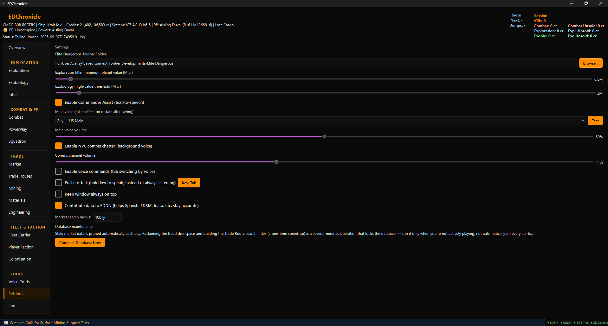

## How it works

EDChronicle reads your Elite Dangerous journal files live while you play, and imports your full journal history into a local SQLite database on first launch. For data your own journals can't provide — galaxy-wide market prices, station info, PowerPlay control, squadron faction presence elsewhere in the galaxy — it draws on the same shared community network the rest of the Elite Dangerous tooling ecosystem uses: [Spansh](https://spansh.co.uk), [EDSM](https://www.edsm.net), [Canonn](https://canonn.tech), [EDAstro](https://edastro.com), and a live [EDDN](https://github.com/EDCD/EDDN) feed. It can optionally contribute your own journal/market data back to EDDN too (on by default, matching EDMarketConnector's own default) — and your own market visits are always saved to your local search database regardless of that setting, so your own dock-and-buy always shows up in your own Market search.

> **The longer EDChronicle stays open, the better it gets.** Galaxy-wide data (market prices, station services, squadron faction presence elsewhere) only accumulates while the app is running and connected to EDDN — a fresh install starts with none of it. Leave the app open while you play (not just while actively looking at it) to let it build up over time, the same way every EDDN-based tool works.

## Installation

Requires Python 3.10 or later — download from [python.org](https://www.python.org/downloads/).

1. Download or clone this repository
2. From the project root, run:

```
install.bat
```

This creates a Python virtual environment, installs all dependencies, and adds an EDChronicle shortcut to your Desktop. Safe to run more than once.

## Running the application

```
launch.bat
```

Double-click `launch.bat` from anywhere — it always resolves paths relative to the project folder.

> **First launch:** EDChronicle imports all your existing journal files on first run — can take a minute or two, with progress shown on the startup screen. Subsequent launches only process new journals and are fast.

## Changing squadron or PowerPlay pledge

EDChronicle follows joining, leaving or defecting from a PowerPlay power, and joining or leaving a squadron, from your journal as it happens. Restart the app afterwards so every tab reloads with your new faction and pledge.

## Updating

```
git pull
install.bat
```

`install.bat` is safe to re-run — it won't recreate the virtual environment, only install newly added dependencies.

## Feedback, suggestions and issues

Have a feature request, found a bug, or want to suggest an improvement?

Open an issue on GitHub: [github.com/evanvz/EDChronicle/issues](https://github.com/evanvz/EDChronicle/issues)

## Support the project

EDChronicle is free and open-source. If it adds value to your gameplay, a coffee is always appreciated.

[](https://ko-fi.com/bobrogers_solo)

## A note on indie development

This project is built and maintained by a solo developer in personal time. If you use, share, or build on EDChronicle, please respect the work that went into it:

- Credit the original project and author in any derivative work
- Do not redistribute modified versions without clearly noting the changes made
- A link back to this repository is always appreciated

## License

[PolyForm Noncommercial License 1.0.0](https://polyformproject.org/licenses/noncommercial/1.0.0) — free to use, study, modify, and share for any noncommercial purpose (personal use, hobby projects, research, education, and similar). Commercial use — selling it, selling derivatives, or using it in a paid product or service — is not permitted without the copyright holder's permission.

Copyright © 2026 CMDR B0B R0GERS

See [LICENSE](LICENSE) for the full license text.
