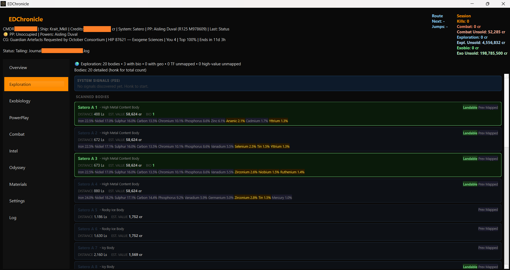
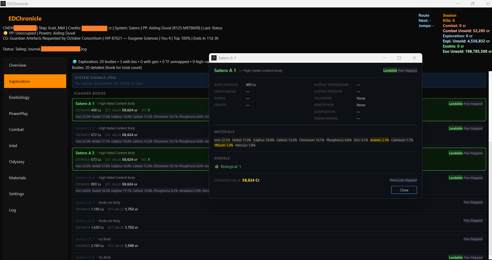
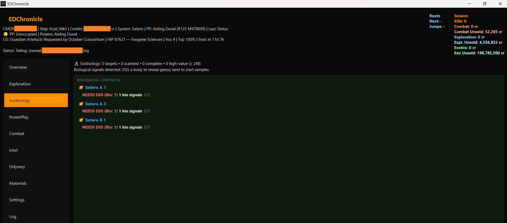
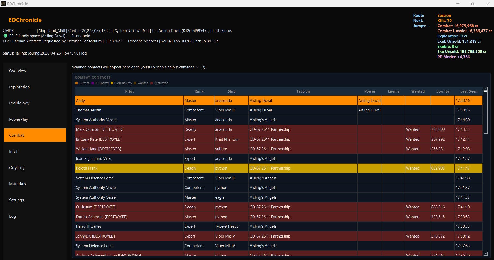
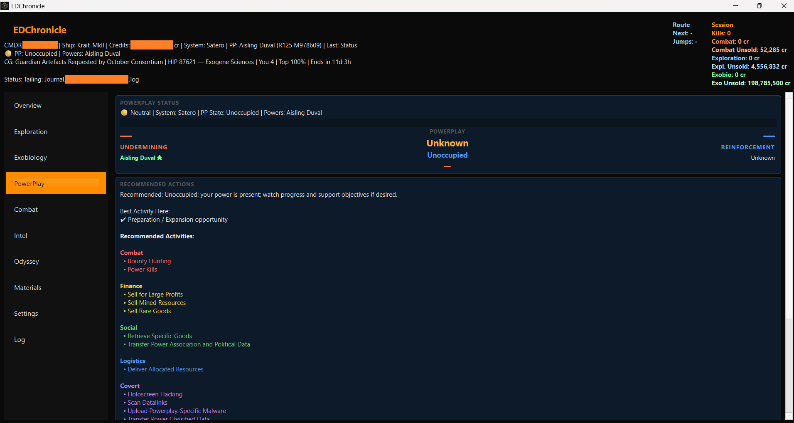
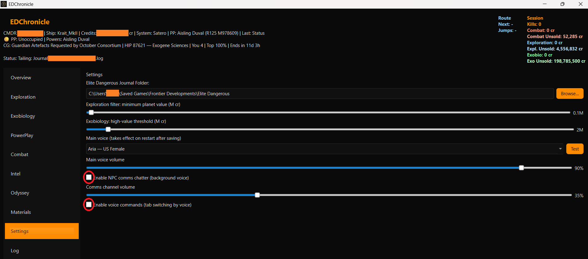

# EDChronicle

[](https://ko-fi.com/bobrogers_solo)

EDChronicle is a Python desktop companion app for Elite Dangerous built for the solo player, with a focus on Exploration, Exobiology, Combat, and PowerPlay. It monitors live journal entries and imports historical journals into a local SQLite database. All data is derived exclusively from in-game journal entries — no external APIs or third-party data sources are used.

## Inspiration

Inspired by [EDCoPilot](https://www.razzafrag.com/) by CMDR RazzaFrag.

## What the app currently does

EDChronicle currently includes:

- Live journal monitoring
- Live status monitoring
- In-memory game state tracking
- UI updates driven by incoming events
- Historical journal import
- Local SQLite persistence for selected imported data
- Exploration-related state handling
- Exobiology-related state handling
- PowerPlay-related state handling
- Item/material metadata support
- User settings management
- Text-to-speech voice alerts for in-game events
- Panel switching for Exploration, Exobiology, Combat, and PowerPlay views

## Screenshots









## Current architecture at a glance

The application currently has two important runtime paths:

### 1. Live runtime path

This path handles what happens while the game is running.

Flow:

1. `edc/app.py` bootstraps the application
2. `edc/ui/main_window.py` creates the main UI
3. `MainWindow.start_auto_watch()` starts live watchers
4. `edc/core/journal_watcher.py` watches journal files and emits events
5. `edc/ui/main_window.py::_on_event(evt)` receives live events
6. `edc/core/event_engine.py::process(event)` updates in-memory state
7. `MainWindow` updates logging and refreshes UI elements

### 2. Historical import path

This path handles backfilling historical journal data into local persistence.

Flow:

1. `edc/app.py::run()` instantiates `JournalImporter`
2. `edc/core/journal_importer.py::import_all()` starts import processing
3. Journal files are parsed and normalized
4. Repository methods in `persistence/repository.py` persist imported data
5. Processed journal files are marked as imported

## Current top-level module ownership

### `edc/core`
Core runtime behavior, state management, live watchers, importer logic, and item catalog support.

Notable files:
- `event_engine.py`
- `journal_importer.py`
- `journal_watcher.py`
- `status_watcher.py`
- `state.py`
- `item_catalog.py`

### `edc/engine/handlers`
Feature-specific event handling logic.

Notable files:
- `exploration.py`
- `exobio.py`
- `inventory.py`
- `powerplay.py`

### `edc/ui`
Main UI, formatting helpers, and settings dialog.

Notable files:
- `main_window.py`
- `settings_dialog.py`
- `formatting.py`

### `persistence`
SQLite schema, connection layer, and repository/data access layer.

Notable files:
- `database.py`
- `repository.py`
- `schema.py`

## Persistence model

The historical importer currently persists data through repository methods such as:

- `save_system(...)`
- `save_body(...)`
- `save_body_signals(...)`
- `save_exobiology(...)`
- `mark_journal_processed(...)`

Live event processing currently updates in-memory state through `EventEngine` and UI logic through `MainWindow`. Historical import is the main confirmed persistence path.

## Development tooling

| Tool | Purpose |
|------|---------|
| Visual Studio Code | Primary IDE |
| Claude Code (VS Code extension) | AI-assisted analysis, architecture discussion, and code changes |
| Python venv (Windows) | Isolated runtime environment |
| Git | Version control with branch-based workflow |
| GitHub | Remote repository and release tracking |

## Installation

Requires Python 3.10 or later — download from [python.org](https://www.python.org/downloads/).

1. Download or clone this repository
2. From the project root, run:

```
install.bat
```

This creates a virtual environment and installs all dependencies.

## Running the application

```
launch.bat
```

> **First launch note:** On first run, EDChronicle will import all your existing journal files into its local database. This can take a minute or two depending on how many journals you have. Progress is shown on the startup screen. Subsequent launches are fast — only new journals are processed.

## Updating

```
git pull
install.bat
```

## Feedback, suggestions and issues

Have a feature request, found a bug, or want to suggest an improvement?

Open an issue on GitHub: [github.com/evanvz/EDChronicle/issues](https://github.com/evanvz/EDChronicle/issues)

All feedback is welcome — whether it's a crash report, a missing feature, or an idea to make the app better for solo commanders.

## Support the project

EDChronicle is free and open-source. If it adds value to your gameplay, a coffee is always appreciated.

[](https://ko-fi.com/bobrogers_solo)

## A note on indie development

This project is built and maintained by a solo developer in personal time. If you use, share, or build on EDChronicle, please respect the work that went into it:

- Credit the original project and author in any derivative work
- Do not redistribute modified versions without clearly noting the changes made
- A link back to this repository is always appreciated

## License

MIT License — free to use, modify and distribute, provided the original copyright notice and author credit are retained in all copies or substantial portions of the software.

Copyright © 2026 Evan van Zyl (bobrogers_solo)

See [LICENSE](../LICENSE) for the full license text.

